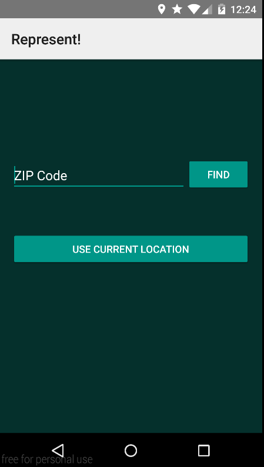
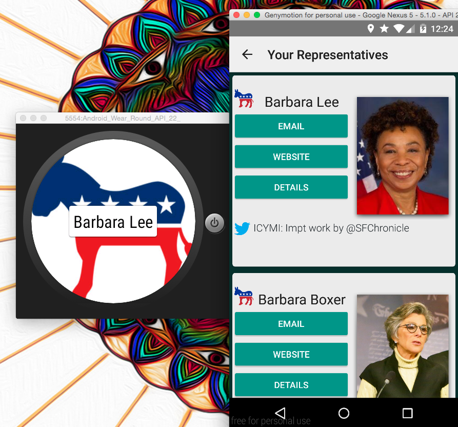
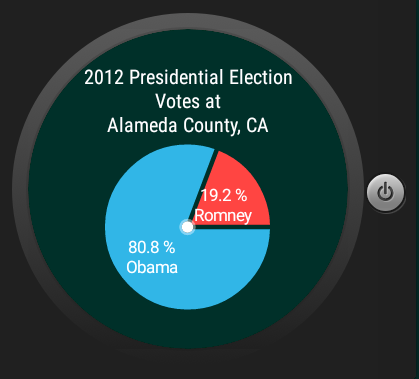

# PROG 02: Represent!

This app lets users look up information about their Congressmen from their locations or by zipcodes. It shows useful information like email, website, sponsored bills, latest Tweet, and committee involvements.

It is important to note that this app is intended for the Nexus 5 with Android 5.1. 

## Authors
Thomas Kim ([taemintkim@berkeley.edu](mailto:taemintkim@berkeley.edu))

## Demo Video

See [Represent! Demo Video] (https://youtu.be/k-YGBt-3jWA)

## Screenshots

## Acknowledgments
CS160 GSIs/TAs
PhilJay's MPAndroidChart API

